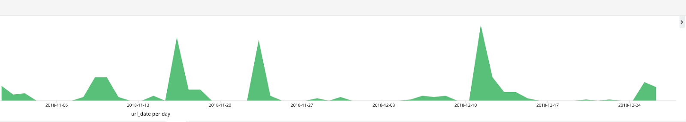

# SecOps with Netflix's Security Monkey

If you are working on cloud technologies and specifically cloud security, the first few questions you would get should be around security, data safety, cost effectiveness etc. Additionally, companies in the FinTech and Healthcare sectors may be concerned about how secure cloud technologies can be for them.

Based on my considerable experience and battle scars, I would recommend looking at Security Monkey which was open sourced in 6/30/2014.

### So, What is Security Monkey?

Security Monkey is an OpenSource application from Netflix which monitors, alerts and reports one or multiple AWS accounts for anomalies. Security Monkey can run on an Amazon EC2 (AWS) instance, Google Cloud Platform (GCP) instance (Google Cloud Platform), or OpenStack (public or private cloud) instance. While Security Monkey's main purpose is security, it also proves a useful tool for tracking down potential problems as it is essentially a change tracking system.

Security Monkey has been an invaluable tool that you will honestly end up using everyday. Referencing here is my chrome browser history reflecting my usage statistics,

> TIP : Script to import Chrome Browser history to Elastic Search https://github.com/nagwww/chrome-history

Here are some common scenarios where Security Monkey can be of help, especially in a multi-account environment:

## The Multi-Account Services; A bulleted list

### Security groups

- Generates an Audit report of all the issues (IE, Security groups which are wide open to the internet or ingress from 0.0.0.0/0, etc.)
- Creates an email alert when security group changes are done, which can come in handy when you have a PCI/SOX/HIPPA compliance related environment.
- Alerts you when a user/developer adds 0.0.0.0/0 to a security group.
- Searches for particular IP/CIDR blocks which is really helpful if you have multiple AWS accounts.
- Helps you identify the Security group name given the security group ID. This is helpful since for cross-account security group access, AWS now no longer shows the security group name, but does show the ID.
- Historical Information : Security Monkey acts as the source control for your security groups. For instance, to know the state of a security group from a month ago, one can go back and perform a diff of the current state.
- Keeps track of your PCI/SOX/HIPPA compliant environment for changes, where you can set an alert to email when a change is performed to a security group or send it to your internal auditor/change control management team directly.
- Alerts when a new Security Group is created.
- Helps locate a security group which no longer exists in AWS or was deleted knowing or unknowingly.

### Amazon S3

- Security Monkey acts as the source control for your S3 buckets policies, ACL, lifecycle rules.
- Generates an audit report of all the current issues (IE, AWS S3 buckets which are accessible to everyone shared across unknown AWS accounts and have conditional statements)
- Creates an e-mail alert when a S3 bucket is added or deleted.
- AWS S3 resource policies are used to grant fine grain access controls for S3 buckets and objects. All the ACLs and policies are stored in security monkey which triggers alerts when changes are done. Comes handy when you have sensitive S3 buckets and you want to monitor for changes.
- Tracks S3 buckets for bucket-level encryption.
- Tracks versioning of buckets.
- Tracks the lifecycle object of an S3 bucket. Lifecycle rules enable you to automatically archive/delete S3 objects based on predefined rule sets.
- Monitors S3 ACLs and bucket policies since last check and alerts when buckets are publicly accessible.

Here is a good read on the [100s AWS S3 buckets left open exposing private data](https://www.helpnetsecurity.com/2013/03/27/thousands-of-amazon-s3-buckets-left-open-exposing-private-data/).

### Identity and Access Management

- Generates a report of all active IAM users with active access keys.
- Lists all active IAM active keys which are not rotated in the last 90 days.
- Lists all inactive access keys which can be used to clean up.
- Lists all the active keys which were not used in the last 90 days.
- Lists IAM User who have AWS Console access, however with no MFA enabled.
- Alerts when an IAM Role has full Admin privileges.
- Finally Security Monkey also acts as a source control for all your IAM policies attached to the users/roles.

A good read on the [AWS Console breach](http://arstechnica.com/security/2014/06/aws-console-breach-leads-to-demise-of-service-with-proven-backup-plan).
