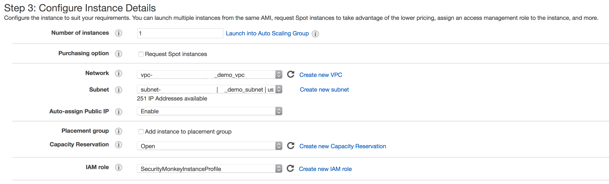

# Stuck in the house of A Thousand Chimps

_**Automated Monitoring for Security Misconfigurations with Security Monkey**_


If you are working on cloud technologies and specifically cloud security, the first few questions you would get should be around security, data safety, cost effectiveness etc. Additionally, companies in the FinTech and Healthcare sectors may be concerned about how secure cloud technologies can be for them.

Based on my considerable experience and battle scars, I would recommend looking at Security Monkey which was open sourced in 6/30/2014.


### So, What is Security Monkey?

Security Monkey is an OpenSource application from Netflix which monitors, alerts and reports one or multiple AWS accounts for anomalies. Security Monkey can run on an Amazon EC2 (AWS) instance, Google Cloud Platform (GCP) instance (Google Cloud Platform), or OpenStack (public or private cloud) instance. While Security Monkey's main purpose is security, it also proves a useful tool for tracking down potential problems as it is essentially a change tracking system.

Security Monkey has been an invaluable tool that you will honestly end up using everyday. Referencing here is my chrome browser history reflecting my usage statistics,

> TIP : Script to import Chrome Browser history to Elastic Search https://github.com/nagwww/chrome-history


Here are some common scenarios where Security Monkey can be of help, especially in a multi-account environment:

## The Multi-Account Services; A bulleted list


### Security Groups

- Generates an Audit report of all the issues (IE, Security groups which are wide open to the internet or ingress from 0.0.0.0/0, etc.)
- Creates an email alert when security group changes are done, which can come in handy when you have a PCI/SOX/HIPPA compliance related environment.
- Alerts you when a user/developer adds 0.0.0.0/0 to a security group.
- Searches for particular IP/CIDR blocks which is really helpful if you have multiple AWS accounts.
- Helps you identify the Security group name given the security group ID. This is helpful since for cross-account security group access, AWS now no longer shows the security group name, but does show the ID.
- Historical Information : Security Monkey acts as the source control for your security groups. For instance, to know the state of a security group from a month ago, one can go back and perform a diff of the current state.
- Keeps track of your PCI/SOX/HIPPA compliant environment for changes, where you can set an alert to email when a change is performed to a security group or send it to your internal auditor/change control management team directly.
- Alerts when a new Security Group is created.
- Helps locate a security group which no longer exists in AWS or was deleted knowing or unknowingly.


### Simple Storage Service

- Security Monkey acts as the source control for your S3 buckets policies, ACL, lifecycle rules.
- Generates an audit report of all the current issues (IE, AWS S3 buckets which are accessible to everyone shared across unknown AWS accounts and have conditional statements)
- Creates an e-mail alert when a S3 bucket is added or deleted.
- AWS S3 resource policies are used to grant fine grain access controls for S3 buckets and objects. All the ACLs and policies are stored in security monkey which triggers alerts when changes are done. Comes handy when you have sensitive S3 buckets and you want to monitor for changes.
- Tracks S3 buckets for bucket-level encryption.
- Tracks versioning of buckets.
- Tracks the lifecycle object of an S3 bucket. Lifecycle rules enable you to automatically archive/delete S3 objects based on predefined rule sets.
- Monitors S3 ACLs and bucket policies since last check and alerts when buckets are publicly accessible.

Here is a good read on the [100s AWS S3 buckets left open exposing private data](https://www.helpnetsecurity.com/2013/03/27/thousands-of-amazon-s3-buckets-left-open-exposing-private-data/).


### Identity and Access Management

- Generates a report of all active IAM users with active access keys.
- Lists all active IAM active keys which are not rotated in the last 90 days.
- Lists all inactive access keys which can be used to clean up.
- Lists all the active keys which were not used in the last 90 days.
- Lists IAM User who have AWS Console access, however with no MFA enabled.
- Alerts when an IAM Role has full Admin privileges.
- Finally Security Monkey also acts as a source control for all your IAM policies attached to the users/roles.

A good read on the [AWS Console breach](http://arstechnica.com/security/2014/06/aws-console-breach-leads-to-demise-of-service-with-proven-backup-plan).


### Elastic Loadbalancers

- Alerts when an ELB is internet facing
- Alerts when ELB logging is not enabled.
- Alerts when deprecated ciphers are enabled on an ELB.
- Provides a list of the weak ciphers if enabled on the ELB policy.


### Simple Email Service

- Monitors SES identities to make sure only valid company email address are configured as verified.
- Monitors for all SES objects that are not verified and can be cleaned up.


### Simple Queue Service

- Alerts when an SQS queue has a policy granting access to everyone or open to world.
- Notifies when there is change to the SQS policy.
- Historical Information: Security Monkey is like the source control for SQS resource policies. To know the state of an SQS policy from a month ago, you can go back and perform a diff of the current state.


### Compliance and Auditing

Here are a few uses cases from PCI-DSS 3.2 and where security monkey comes handy:

| PCI # | PCI-DSS 3.2 | Security Monkey |
|-------|-------------|-----------------|
| 10.2.7 | Creation and Deletion of System level objects | Logs and Alerts on changes to: <ul><li>IAM Users</li><li>Security Groups</li><li>Elastic IP</li><li>Route 53</li></ul> |
| 10.5.4 | Write logs for external-facing technologies onto a secure, centralized, internal log or service media device | Logs for external-facing echnologies <ul><li>Security Group Config</li><li>ELB Config</li><li>SES</li><li>IAM are queried and monitored by Security</li></ul> |
| 10.6 | Review logs and security events for all system components to identify anomalies or suspicious activities | Security monkey examines security policies nd procedures to verify that the procedures are defined for reviewing items in **10.6.1** at least daily, either manually or via log tools |
| 10.6.1 | Review the following at least daily <ul><li>All security events</li><li>Logs of all components that store, process or transmit CHD and/or SAD</li><li>Logs all system critical components</li></ul> | Security Monkey sends daily reports on <ul><li>Security Groups</li><li>S3</li><li>IAM</li><li>ELB policies</li></ul> |
| 10.7 | Retain audit trail history for at least one year, with a minimum of three months immediately available for analysis | Security Monkey monitors the S3 bucket lifecycle, which shows the audit log retention policy |

Daily audit reports generated by Security Monkey


## The Architecture


### Instance Diagram

The components that make up Security Monkey are as follows (not AWS specific):


### Access Diagram

Security Monkey accesses accounts to scan via credentials it is provided (**Role Assumption** where available).


## How to set up Security Monkey?

##### Set up your IAM roles

At first, we are going to create two IAM roles namely `SecurityMonkeyInstaceProfile` and `SecurityMonkey`. Before creating these roles we need to create our own custom policies for them. Navigate to your [IAM console](https://console.aws.amazon.com/iam/) and on the left pane click on Policies. Choose to **Create a Policy** and select the JSON tab.

Paste the following JSON code in the given area:

```json
{
  "Version": "2012-10-17",
  "Statement": [{
    "Effect": "Allow",
    "Action": [
      "ses:SendEmail"
    ],
    "Resource": "*"
  }, {
    "Effect": "Allow",
    "Action": "sts:AssumeRole",
    "Resource": "*"
  }]
}
```

After that name the policy `SecurityMonkeyLaunchPerms`. Similar to this create a new policy named `SecurityMonkeyReadOnly` with the following JSON code:

```json
{
  "Version": "2012-10-17",
  "Statement": [{
    "Action": [
      "cloudwatch:Describe*",
      "cloudwatch:Get*",
      "cloudwatch:List*",
      "ec2:Describe*",
      "elasticloadbalancing:Describe*",
      "iam:List*",
      "iam:Get*",
      "route53:Get*",
      "route53:List*",
      "rds:Describe*",
      "s3:GetBucketAcl",
      "s3:GetBucketCORS",
      "s3:GetBucketLocation",
      "s3:GetBucketLogging",
      "s3:GetBucketPolicy",
      "s3:GetBucketVersioning",
      "s3:GetLifecycleConfiguration",
      "s3:ListAllMyBuckets",
      "sdb:GetAttributes",
      "sdb:List*",
      "sdb:Select*",
      "ses:Get*",
      "ses:List*",
      "sns:Get*",
      "sns:List*",
      "sqs:GetQueueAttributes",
      "sqs:ListQueues",
      "sqs:ReceiveMessage"
    ],
    "Effect": "Allow",
    "Resource": "*"
  }]
}
```

Now we are ready with our policies and we can proceed to our role creation. Navigate to your IAM console again and select **Roles** from the left pane. Click on **Create Role** and on the next page select **EC2** as the service.


In the next page add your previously created Policy `SecurityMonkeyLaunchPerms` to the role.


And on the last page, name your role `SecurityMonkeyInstaceProfile` and proceed with the role creation. Repeat the same steps to create another role and attach the Policy `SecurityMonkeyReadOnly` this time. Name this role `SecurityMonkey` and proceed with role creation.


After completing the above successfully, go to your newly created Role `SecurityMonkey` and navigate to the **Trust relationships** tab and add the following JSON code:

```json
{
  "Version": "2008-10-17",
  "Statement": [{
    "Sid": "",
    "Effect": "Allow",
    "Principal": {
      "AWS": [
        "arn:aws:iam::<YOUR ACCOUNT_ID GOES HERE>:role/SecurityMonkeyInstanceProfile"
      ]
    },
    "Action": "sts:AssumeRole"
  }]
}
```

> **NOTE:** You will have to add your own Account ID in the above code.

Your `SecurityMonkey` role should now look something like this:


Adding more accounts
To have your instance of security monkey monitor additional accounts, you must add a `SecurityMonkey` role in the new account. Follow the instructions above to create the new SecurityMonkey role. The T**rust Relationship** policy should have the account ID of the account where the security monkey instance is running.

> **NOTE:** Additional `SecurityMonkeyInstanceProfile` roles are not required. You only need to create a new `SecurityMonkey` role.
> **NOTE:** You will also need to add the new account in the Web UI, and restart the scheduler.


### Creating an EC2 Instance

For creating an EC2 instance navigate to your [EC2 console](https://console.aws.amazon.com/ec2/) and select **Launch Instance**.

Select an AMI or Amazon Machine Instance in the next page. **Do not click on Review and Launch** as we have to add our Instance that we had previously created. Navigate to the **Configure Instance** tab and under **IAM Role**, select `SecurityMonkeyInstanceProfile`.



You will be asked to create a key before launching the instance. This **key** will be required to connect to the instance and is generated only **ONCE**. Hence, it needs to be kept properly and further, you will be asked to change the permissions of the key file so that the access can be restricted. After that ssh can be used as shown below to connect to your EC2 instance.


You may now launch the new instance. Please take note of the **Public DNS** entry. We will need that later when configuring security monkey.


### Keypair
You may be prompted to download a keypair. You should protect this keypair; it is used to provide ssh access to the new instance. Put it in a safe place. You will need to change the permissions on the keypair to 600:

```bash
chmod 600 ~/Downloads/SecurityMonkeyKeypair.pem
mv ~/Downloads/SecurityMonkeyKeypair.pem ~/.ssh
```


### Connecting to your new instance:

We will connect to the new instance over ssh:

```bash
ssh -i ~/.ssh/SecurityMonkeyKeyPair.pem -l ubuntu <PUBLIC_IP_ADDRESS>
```


### Installing Prerequisites

Now we have a fresh install of Ubuntu as an EC2 instance. Let's add our hostname to our `/etc/hosts`

```bash
sudo echo >> "127.0.0.1 $(hostname)" /etc/hosts
```

Create and seed our logging folders:

```bash
sudo mkdir /var/log/security_monkey
sudo chown www-data /var/log/security_monkey

sudo mkdir /var/www
sudo chown www-data /var/www

sudo touch /var/log/security_monkey/security_monkey.error.log
sudo touch /var/log/security_monkey/security_monkey.access.log
sudo touch /var/log/security_monkey/security_monkey-deploy.log
sudo chown www-data /var/log/security_monkey/security_monkey-deploy.log
```

Let's install the tools we need for Security Monkey:

```bash
sudo apt-get update
sudo apt-get -y install python-pip python-dev python-psycopg2 postgresql postgresql-contrib libpq-dev nginx supervisor git swig python-m2crypto
```


### Setup a Local Postgres

For production, you will want to use an AWS RDS Postgres database. For this guide, we will setup a database on the instance that was just launched.

We will now create and configure the postrgres user and database. setting the password to  **securitymonkeypassword**:

```bash
# Configuring the Database

sudo -u postgres psql
CREATE DATABASE "secmonkey";
CREATE ROLE "securitymonkeyuser" LOGIN PASSWORD 'securitymonkeypassword';
CREATE SCHEMA secmonkey;
GRANT Usage, Create ON SCHEMA "secmonkey" TO "securitymonkeyuser";
set timezone TO 'GMT';
SELECT now();
\q
```


### Clone the Security Monkey Repo

Next we'll clone and install the package:

```bash
sudo apt-get install -y virtualenv

cd /usr/local/src
sudo git clone --depth 1 --branch master https://github.com/Netflix/security_monkey.git
sudo chown -R `whoami`:www-data /usr/local/src/security_monkey

cd security_monkey
export LC_ALL="en_US.UTF-8"
export LC_CTYPE="en_US.UTF-8"
virtualenv venv

source venv/bin/activate
pip install --upgrade setuptools
pip install --upgrade pip
pip install --upgrade urllib3[secure]   # to prevent InsecurePlatformWarning
python setup.py develop
```

> **ULTRA SUPER IMPORTANT SPECIAL NOTE PLEASE READ THIS**

In the commands above, a [Python virtual environment](http://python-guide-pt-br.readthedocs.io/en/latest/dev/virtualenvs/) is created. ALL Security Monkey commands from this point forward **MUST** be done from within the virtual environment. If following the instructions above, you can get back into the virtual environment by running the following commands:

```bash
cd /usr/local/src/security_monkey
source venv/bin/activate
```


### Compile (or Download) the Web UI

If you're using the stable (master) branch, you have the option of downloading the Web UI instead of compiling it. Visit the [latest release](https://github.com/Netflix/security_monkey/releases/latest) and download **static.tar.gz**.

```bash
cd /usr/local/src/security_monkey/
wget https://github.com/Netflix/security_monkey/releases/download/1.1.3/static.tar.gz
tar zxvf static.tar.gz && rm -f $_
```
Otherwise, If you're using the bleeding edge (develop) branch, you will need to compile the Web UI by following these instructions:

```bash
# Get the Google Linux package signing key.
curl https://dl-ssl.google.com/linux/linux_signing_key.pub | sudo apt-key add -

# Set up the location of the stable repository.
cd ~
curl https://storage.googleapis.com/download.dartlang.org/linux/debian/dart_stable.list > dart_stable.list
sudo mv dart_stable.list /etc/apt/sources.list.d/dart_stable.list
sudo apt-get update
sudo apt-get install -y dart=1.24.*

# Build the Web UI
cd /usr/local/src/security_monkey/dart
/usr/lib/dart/bin/pub get
/usr/lib/dart/bin/pub build

# Copy the compiled Web UI to the appropriate destination
sudo mkdir -p /usr/local/src/security_monkey/static/
sudo /bin/cp -R /usr/local/src/security_monkey/dart/build/web/* /usr/local/src/security_monkey/static/
sudo chgrp -R www-data /usr/local/src/security_monkey
```


### Create the database tables:
Security Monkey uses Flask-Migrate (Alembic) to keep database tables up to date. To create the tables, run this command:

```bash
cd /usr/local/src/security_monkey/
monkey db upgrade
```


### Add Amazon Accounts

```bash
monkey amazon_accounts
```


### Adding S3 Canonical IDs

```bash
monkey fetch_aws_canonical_ids
```

AWS S3 has an ACL system that makes use of Canonical IDs. These IDs are not easy to find, but are very important for Security Monkey to know if an S3 bucket has unknown cross-account access. The above command is a convenience to automatically find those Canonical IDs and associate them with your account. It is highly recommended that you run this command after you add an AWS account.


### Create the first user:

Users can be created on the command line or by registering in the Web UI:

```bash
monkey create_user "you@youremail.com" "Admin"
> Password:
> Confirm Password:

`create_user` takes two parameters:

email address
role (One of [`View`, `Comment`, `Justify`, `Admin`])
```

### Create an SSL Certificate

Now we will use a self-signed SSL certificate. In production, you will want to use a certificate that has been signed by a **trusted certificate authority**.:

```bash
cd ~
```

There are some great instructions for generating a certificate on the Ubuntu website:

[Ubuntu - Create a Self Signed SSL Certificate](https://help.ubuntu.com/14.04/serverguide/certificates-and-security.html)

Or to just generate a _Never use cert_

```bash
openssl req  -nodes -new -x509  -keyout server.key -out server.crt
```

Then, the  last commands you need to run from that tutorial are in the "Installing the Certificate" section:

```bash
sudo cp server.crt /etc/ssl/certs
sudo cp server.key /etc/ssl/private
```

Once you have finished the instructions at the link above, and these two files are in your `/etc/ssl/certs` and `/etc/ssl/private`, you are ready to move on.


### Setup Nginx:

Security Monkey uses `gunicorn` to serve up content on its internal `127.0.0.1` address. For better performance, and to offload the work of serving static files, we wrap gunicorn with nginx. Nginx listens on `0.0.0.0` and proxies some connections to gunicorn for processing and serves up static files quickly.

**securitymonkey.conf**

Copy the config file into place:

```bash
sudo cp /usr/local/src/security_monkey/nginx/security_monkey.conf /etc/nginx/sites-available/security_monkey.conf
sudo ln -s /etc/nginx/sites-available/security_monkey.conf /etc/nginx/sites-enabled/security_monkey.conf
sudo rm /etc/nginx/sites-enabled/default
sudo service nginx restart
```

### Start the API server

Manually start Security Monkey with `monkey run_api_server`, and if God loves you, your should see this:


